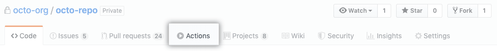
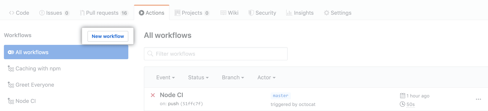
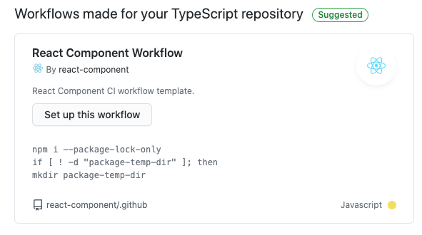

# GitHub Actions

🤖 React Component GitHub Actions CI workflow template.

ref: [GitHub docs](https://docs.github.com/en/free-pro-team@latest/actions/learn-github-actions/sharing-workflows-with-your-organization)

## 💬 How to use?

1、On GitHub, navigate to the main page of the repository.

2、Under your repository name, click Actions.

3、If your repository already has existing workflows: In the upper-left corner, click New workflow.

4、In section titled "Workflows created by React Component". Click **Set up this workflow**.

## 💬 How to migrate from travis CI?

1、Remove `.travis.yml` from the root dir of project.

2、Update build ci badge url in `README.md`.

ref: [Update Badge](https://github.com/react-component/trigger/pull/213)

3、Following [How to use](#how-to-use) to set up github actions.
